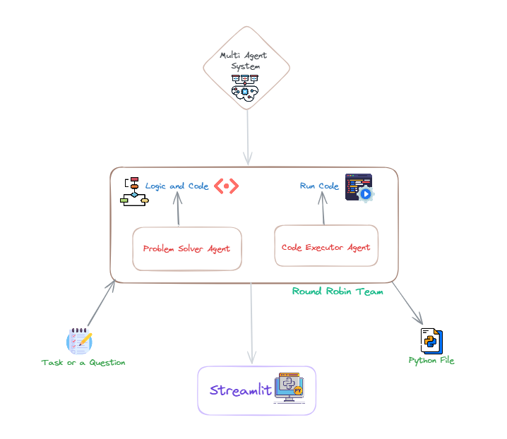

# DSA Solving Multi Agent System

## Problem System

    Create a tool that uses a multi-agent system with AutoGen to generate
    and run Python code for solving user-specified Data Structure and Algorithms
    (DSA) problems, like binary search or Fibonacci Sequence calculation.

## Solution

 